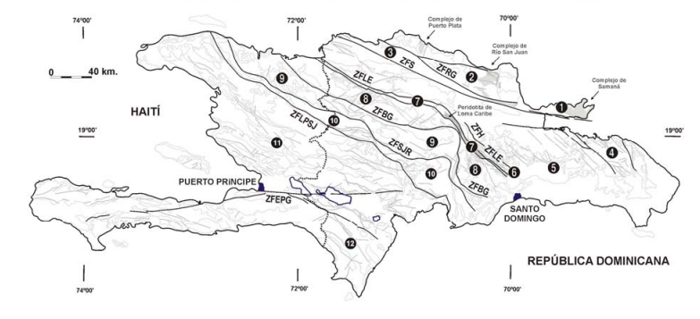
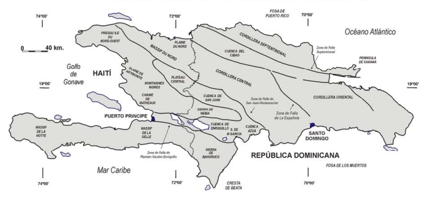
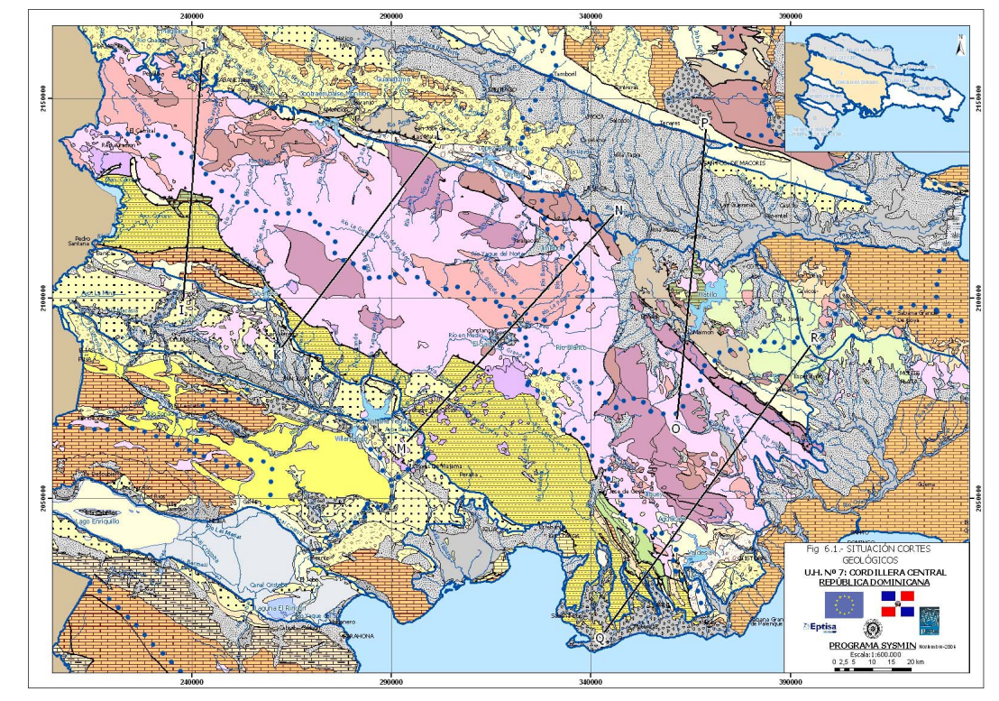
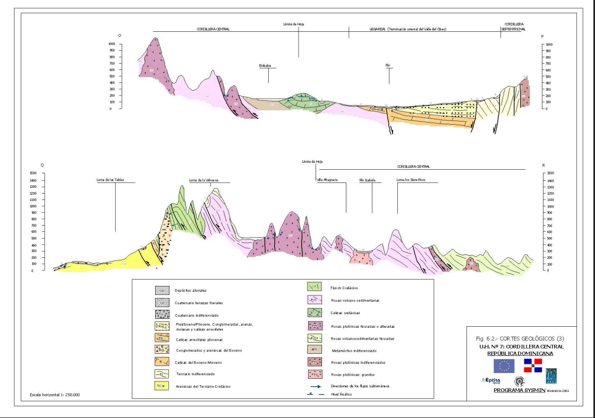

```{r setup, include=FALSE}
knitr::opts_chunk$set(
  echo = FALSE,
  message = FALSE,
  warning = FALSE,
  comment = "#>",
  fig.width = 7,
  fig.height = 5,
  out.width = "100%"
)
set.seed(123)

# Paquetes (ajusta según el ejercicio elegido)
pkg_needed <- c("vegan", "cluster", "indicspecies", "adespatial",
                "iNEXT", "SpadeR", "ggplot2", "dplyr", "tidyr", "readr")
has_pkg <- sapply(pkg_needed, requireNamespace, quietly = TRUE)
if (!all(has_pkg)) {
  message("Paquetes no críticos ausentes (se omitirán bloques opcionales): ",
          paste(names(has_pkg)[!has_pkg], collapse = ", "))
}
invisible(sapply(names(has_pkg)[has_pkg], library, character.only = TRUE))
```


> # Resumen
> 
> La presente investigación realiza una revisión crítica de los modelos geomorfológicos de William Morris Davis y Walther Penck para analizar la transición epistemológica hacia la geomorfología de procesos contemporánea. A través de un diseño cualitativo y documental, el estudio identifica que, si bien los modelos clásicos proporcionaron una base narrativa fundamental para la disciplina, sus premisas de estabilidad cortical prolongada y sistemas cerrados contradicen principios geofísicos modernos como la isostasia y la tectónica de placas. Los resultados indican que el "Ciclo Geográfico" persiste en los libros de texto de introducción como un "andamiaje cognitivo" didáctico y no por su precisión científica. Se concluye que la enseñanza de las geociencias debe evolucionar hacia la integración de modelos de evolución del paisaje (LEM) y sistemas abiertos para cerrar la brecha entre la docencia universitaria y la investigación de frontera actual.
> 
> **Palabras clave:** *Geomorfología; Ciclo Geográfico; Davis; Penck; Evolución del Relieve; Sistemas Abiertos.*

---

> # Abstract
> 
> This research performs a critical review of the geomorphic models of William Morris Davis and Walther Penck to analyze the epistemological transition toward contemporary process geomorphology. Using a qualitative and documentary design, the study identifies that while classical models provided a fundamental narrative basis for the discipline, their premises of prolonged crustal stability and closed systems contradict modern geophysical principles such as isostasy and plate tectonics. The results indicate that the "Geographical Cycle" persists in introductory textbooks as a didactic "pedagogical scaffolding" rather than for its scientific accuracy. The study concludes that geosciences education must evolve toward the integration of landscape evolution models (LEM) and open systems to bridge the gap between undergraduate teaching and current frontier research.
> 
> **Keywords:** *Geomorphology; Geographical Cycle; Davis; Penck; Landscape Evolution; Open Systems.*


**Palabras clave:** Geomorfología; Ciclo Geográfico; Davis; Penck; Evolución del Relieve.

# 1. Introducción

La geomorfología ha experimentado una transformación rotunda en su marco conceptual al evolucionar desde una disciplina principalmente histórica hacia una ciencia de procesos. La geomorfología histórica, fundamentada en el análisis cronológico y descriptivo del relieve [@davis1899geographical], dio paso a la geomorfología de procesos. Este cambio tiene sus raíces en las críticas al ciclo davisiano y la recuperación de principios físicos propuestos por autores como Grove Karl Gilbert, quien argumentaba que el relieve es el resultado de un ajuste dinámico entre la resistencia de los materiales y las fuerzas erosivas, una idea que hoy sustenta la mecánica y química de los paisajes modernos [@depedraza1996geomorfologia; @anderson2010geomorphology].

A pesar de este giro hacia la cuantificación, persiste una notable desconexión entre la investigación de frontera y la enseñanza de las geociencias, ya que libros de texto fundamentales, como el influyente manual de Tarbuck y Lutgens [@lutgens2016foundations], continúan utilizando el "Ciclo Geográfico" de William Morris Davis como eje pedagógico, postulando que el relieve atraviesa una secuencia lineal de estadios —juventud, madurez y senectud— tras un levantamiento tectónico rápido [@davis1899geographical; @chorley2009history]."

La persistencia de estos esquemas resulta paradójica, dado que sus premisas de estabilidad cortical prolongada contradicen los principios modernos de la isostasia y la tectónica de placas, los cuales demuestran que el levantamiento y la erosión operan como procesos simultáneos y concurrentes [@article]. La vigencia de los esquemas tradicionales en el currículo académico plantea una paradoja epistemológica fundamental: ¿por qué los modelos clásicos de evolución del relieve continúan como el pilar de la enseñanza geomorfológica a pesar de las severas objeciones que los rodean? Esta cuestión invita a considerar si ciertos componentes de la herencia davisiana, tales como su nomenclatura de estadios evolutivos, conservan todavía una utilidad descriptiva dentro de la narrativa del paisaje contemporáneo [@luo2024reincarnation]. Asimismo, surgen interrogantes sobre las contradicciones inherentes al modelo de Penck y la validez teórica de sus tesis sobre el *Piedmonttreppen* ante los avances de la geodinámica [@cleverson2024revisiting], pues el núcleo del debate reside en las fallas metodológicas y los supuestos tectónicos erróneos —específicamente la premisa de la estabilidad cortical— que precipitaron el declive de estas teorías en la investigación profesional [@orme2007rise].

Bajo este contexto, el presente trabajo tiene como objetivo general realizar una revisión crítica de los postulados de Davis y Penck para analizar la transición epistemológica hacia la geomorfología de procesos, identificando cómo las teorías de equilibrio dinámico de autores como Hack [@Hack1960InterpretationOE] invalidaron los sistemas cerrados. De manera específica, el estudio analiza la evolución de las vertientes y la terminología de estadios frente al concepto de retroceso paralelo de laderas de Penck [@penck1924], el cual sostiene que las pendientes mantienen su ángulo mientras retroceden lateralmente, desafiando la simplificación davisiana del suavizado de pendientes. Finalmente, el trabajo identifica las fallas geofísicas que propiciaron el declive de los modelos cíclicos y evalúa la función pedagógica de estos como un "andamiaje cognitivo" (*pedagogical scaffolding*) en textos actuales [@walsh2026pedagogical], determinando cómo sobreviven como herramientas didácticas a pesar de su obsolescencia en la investigación de vanguardia.

Para garantizar la validez de esta revisión, se emplea una metodología basada en la triangulación de perspectivas teóricas [@inbook], permitiendo contrastar los manuales de introducción con la literatura técnica más reciente. Este enfoque metodológico sigue los principios de la investigación científica cualitativa y documental [@arias2012proyecto], permitiendo una interpretación sociológica y teórica de la evolución del pensamiento geográfico [@denzin2017research]. Al integrar visiones clásicas con críticas contemporáneas sobre la geomorfología tectónica [@article; @barroso2013geomorphology] y el análisis morfométrico de sistemas de drenaje [@melton1958correlation], esta investigación busca esclarecer si la enseñanza de la geomorfología debe desprenderse definitivamente de su herencia cíclica o si esta cumple una función necesaria en la formación inicial de los científicos de la Tierra.


# 2. Materiales y Métodos

El presente estudio desarrolla un enfoque cualitativo de carácter epistemológico y documental mediante un diseño de revisión crítica que va mas allá la simple descripción bibliográfica para evaluar la validez de las teorías y la evolución de los paradigmas científicos [@arias2012proyecto]. La investigación centra su atención en el contraste dialéctico entre la geomorfología histórica de sistemas cerrados y la geomorfología de procesos basada en sistemas abiertos [@chorley1971physical]. Para ello, se integra una selección de fuentes: las obras fundacionales de Davis [@davis1899geographical] y Penck [@penck1924] para extraer los postulados originales; el manual de Lutgens, Tarbuck y Tasa [@lutgens2016foundations] como referente de la perpetuación de modelos históricos en la educación superior; y artículos de revisión sobre geodinámica e isostasia [@orme2007rise; @cleverson2024revisiting] que validan las inconsistencias de los modelos tradicionales frente a la investigación de frontera actual. Para ello, se integra una selección de fuentes que incluye manuales clásicos y técnicos contemporáneos que abordan la unidad de la cuenca de drenaje como sistema fundamental [@ritter2011drainage], así como revisiones sobre la física de las ecuaciones que gobiernan la evolución del paisaje [@chen2014landscape].

La estrategia de búsqueda y recolección de información se estructuró de forma cronológica y temática para delimitar claramente la brecha entre las fuentes antiguas y las contemporáneas. Se realizó una búsqueda sistemática en bases de datos de alto impacto y Google Scholar, empleando términos de búsqueda técnicos en inglés como *“Geomorphology”*, *“Cycle of erosion”*, *“Slope evolution”*, *“Orogeny”* y *“Equilibrium theory”* junto a los apellidos de los autores clave (*Davis*, *Penck*, *Hack*). La delimitación temporal permitió separar el corpus en dos bloques: fuentes primarias clásicas (1899-1924) para el análisis de los postulados originales, y fuentes críticas contemporáneas (2000-2026) para evaluar la vigencia didáctica y científica de dichos modelos en el siglo XXI [@luo2024reincarnation; @walsh2026pedagogical].

El análisis se basa en una triangulación teórica que permite converger diversas perspectivas científicas y metodológicas [@inbook; @denzin2017research]. En la primera etapa, se contrastan los estadios evolutivos de Davis ("juventud, madurez y senectud") con el "retroceso paralelo de laderas" y el *Piedmonttreppen* de Penck [@penck1924]. Posteriormente, estos modelos se evalúan bajo los principios de la termodinámica de sistemas abiertos y la teoría del equilibrio [@strahler1950equilibrium; @melton1958correlation]. Este enfoque permite identificar las fallas geofísicas derivadas de la premisa de estabilidad cortical prolongada y desglosar cómo la transición de una visión histórica a una procesal transformó la interpretación del relieve [@barroso2013geomorphology].

Finalmente, el análisis evalúa la dimensión pedagógica de estos modelos obsoletos, determinando su función como "andamiaje cognitivo" (*pedagogical scaffolding*) en los textos actuales de geociencias [@walsh2026pedagogical]. Se examina si el mantenimiento de la nomenclatura davisiana responde a una necesidad didáctica para facilitar el aprendizaje inicial o si representa un lastre epistemológico que distorsiona la comprensión de la tectónica activa [@article]. Esta fase final del análisis sintetiza la relación entre la investigación profesional y la enseñanza, utilizando la historia de la geomorfología para comprender por qué ciertas estructuras teóricas persisten en el currículo a pesar de haber sido superadas por el enfoque sistémico y de procesos [@chorley2009history].

# 3. Resultados

## 3.1. Discrepancias Estructurales entre Modelos Clásicos

Tras la revisión crítica de las fuentes primarias, la investigación identifica que la principal divergencia entre los modelos de Davis [@davis1899geographical] y Penck [@penck1924] radica en la temporalidad de la tectónica y la resultante evolución de las vertientes. Mientras que Davis postula un sistema cerrado con un levantamiento inicial rápido seguido de una quietud cortical prolongada, el análisis de Penck revela un sistema dinámico donde la erosión y el levantamiento operan como procesos concurrentes.

Esta distinción técnica es profundizada por @gutierrez2008geomorfologia, quien señala que mientras el modelo davisiano se centra en el "suavizamiento de pendientes" (slope decline), otros modelos como el de King proponen el retroceso de escarpes y la formación de pediplanicies. Este último proceso es predominante en climas áridos y semiáridos, donde la ladera mantiene su ángulo mientras retrocede lateralmente, dejando atrás una superficie basal suave o pedimento, un mecanismo que Davis no logró integrar satisfactoriamente en su ciclo universal.

Asimismo, la transición hacia la geomorfología de procesos ha desplazado la unidad de análisis desde la región fisiográfica hacia la cuenca de drenaje. Como explican @ritter2011drainage, la cuenca no es solo un área geográfica, sino un sistema compuesto por una red de canales y vertientes mutuamente ajustados para la evacuación de agua y sedimentos. Esta visión sistémica permite realizar análisis morfométricos —como la curva hipsométrica y la densidad de drenaje— para describir las fases de evolución del paisaje de forma cuantitativa, superando la descripción puramente visual y biográfica de los estadios davisianos [@depedraza1996geomorfologia]. En la Figura \@ref(fig:ciclo-davis) se observa la progresión clásica hacia la peneplanicie que propone Davis, la cual contrasta con el modelo de evolución de vertientes de Walther Penck (Ver Figura \@ref(fig:fig-penck)). Los contrastes fundamentales entre estas escuelas de pensamiento se detallan a continuación (ver Tabla 1 \@ref(tab:comparativa-modelos))

```{r ciclo-davis, fig.cap="Ciclo de Davis: juventud, madurez y vejez", out.width="50%", fig.align="center", echo=FALSE}
knitr::include_graphics("ciclo-davis.jpeg")
```

```{r fig-penck, fig.cap="Modelo de evolución de vertientes de Walther Penck.", out.width="50%", fig.align="center", fig.pos="H", echo=FALSE}
knitr::include_graphics("penck.jpeg")
```

Tabla 1. (\#tab:comparativa-modelos) Comparación de los supuestos críticos entre los modelos de Davis y Penck.

| Criterio | Modelo de Davis | Modelo de Penck |
| :--- | :--- | :--- |
| **Tectónica** | Levantamiento rápido e inicial. | Levantamiento y erosión simultáneos. |
| **Clima** | Templado/Húmedo (principalmente). | Factor secundario a la tectónica. |
| **Tiempo** | Factor lineal y determinante (estadios). | Irrelevante; prima la tasa de proceso. |
| **Laderas** | Descenso de pendiente (*Slope Decline*). | Retroceso de pendiente (*Slope Retreat*). |
| **Formas Finales** | Peneplanicie. | *Endrumpf* / *Piedmonttreppen*. |

## 3.2. Contradicciones con la Geofísica Moderna

Al contrastar estos modelos clásicos con los principios de la geomorfología sistémica y mecánica [@anderson2010geomorphology], el estudio constata fallas críticas que socavan su validez científica:

Omisión de la Isostasia: El ciclo de Davis ignora el levantamiento compensatorio de la litosfera. Según @anderson2010geomorphology, la remoción de masa por erosión provoca un ajuste isostático que eleva la columna cortical, invalidando la progresión lineal hacia una peneplanicie absoluta y estática.

Entropía vs. Equilibrio Dinámico: El relieve no funciona como un sistema cerrado que agota su energía. Por el contrario, es un sistema abierto que busca un equilibrio dinámico, donde las formas se ajustan constantemente a un flujo continuo de energía y materia [@depedraza1996geomorfologia].

Realismo Tectónico: La modelización numérica contemporánea (LEM) demuestra que la evolución del paisaje se rige por leyes de conservación de masa y ecuaciones diferenciales de transporte, lo que contradice la simplificación narrativa de los modelos decimonónicos [@chen2014landscape].

## 3.3. Presencia de Modelos Obsoletos en Textos Base

El análisis del manual de Lutgens, Tarbuck y Tasa [@lutgens2016foundations] confirma la persistencia del modelo davisiano en la pedagogía actual de las geociencias. Aunque el texto reconoce los avances en la dinámica terrestre, mantiene la terminología de "juventud, madurez y vejez" como eje vertebrador en la descripción de la evolución del relieve fluvial. Los resultados indican que la literatura educativa retiene este modelo por su estructura narrativa simplificada y no por su precisión geofísica, estableciendo una dicotomía entre el rigor científico y la accesibilidad didáctica [@luo2024reincarnation].

## 3.4. Aplicación al contexto de La Española: El Relieve Dominicano como Sistema Abierto

La transición epistemológica analizada cobra una vigencia crítica al aplicarse al contexto geomorfológico de la República Dominicana. A diferencia de las regiones continentales estables donde se originaron los modelos de Davis, la isla de La Española se sitúa en una zona de colisión compleja entre el arco-isla y el continente [@perez2007geologia]. Como se observa en el marco tectónico regional (Figura \@ref(fig:fig-tectonica)), el territorio está caracterizado por una tectónica activa y un levantamiento cortical continuo condicionado por límites de placa y grandes fallas de desgarre como la Septentrional y Enriquillo-Plantain Garden [@sgn_biblioteca]. Esta realidad geodinámica invalida la premisa davisiana de una fase de "paz tectónica" tras un levantamiento inicial único.

```{r fig-tectonica, fig.cap="Mapa de los terrenos tectonoestratigráficos de La Española según Mann et al. (1991a): (1) Samaná; (2) Puerto Plata-Pedro García-Río San Juan; (3) Altamira; (4) Seibo; (5) Oro; (6) Tortue-Maimón-Amina; (7) Loma Caribe-Tavera; (8) Duarte; (9) Tireo; (10) Trois Rivières-Peralta; (11) Presq’ile du Nord-Ouest-Neiba; y (12) Hotte-Selle-Bahoruco. Zonas de Falla: ZFRG, Río Grande; ZFS, Septentrional; ZFBG, Bonao-La Guácara; ZFH, Hatillo; ZFLE, La Española; ZFEPG, Enriquillo Plantain Garden; ZFSJR, San José-Restauración; ZFLPSJ, Los Pozos-San Juan.", out.width="80%", fig.align="center", fig.pos="H", echo=FALSE}

```

Bajo la óptica de la geomorfología de procesos, los sistemas montañosos descritos por @delafuente1976geografia y @zoppis1969atlas representan sistemas en equilibrio dinámico. Como documenta @camara1997dinamica, la dinámica del medio físico en esta región caribeña está marcada por una intensa "tropicalidad insular" donde las altas tasas de erosión y el levantamiento tectónico operan de forma simultánea. En este escenario, el relieve no "envejece" hacia una penillanura; por el contrario, la advección de roca compensa la denudación, manteniendo paisajes escarpados que se reflejan en el mapa fisiográfico nacional (Figura \@ref(fig:fig-cordilleras)).

```{r fig-cordilleras, fig.cap="Mapa físico nacional de la Isla de La Española: se muestran las principales unidades fisiográficas como la Cordillera Central, Septentrional y Oriental, así como las Sierras de Neiba y Bahoruco, y las cuencas sedimentarias del Cibao, San Juan y Enriquillo. Basado en datos del Servicio Geológico Nacional.", out.width="80%", fig.align="center", fig.pos="H", echo=FALSE}

```

Este comportamiento se refleja en la morfometría de las unidades hídricas nacionales. Según los datos del Mapa Geológico 1:250,000 [@mollat2004mapa; @zoppis1969atlas], las cuencas de drenaje dominicanas, como la del Río Yaque del Norte y el Yaque del Sur, funcionan como la unidad fundamental de ajuste de masa y energía [@ritter2011drainage]. En estas cuencas, la red de canales se ajusta constantemente a las fallas activas y a la litología variada, lo que impide la formación de una peneplanicie uniforme. Esta complejidad estructural se evidencia en el mapa de situación de cortes geológicos (Figura \@ref(fig:mapa-situacion)), donde se observa la densa segmentación de la Cordillera Central por fallas transversales que condicionan el trazado fluvial.

```{r mapa-situacion, fig.cap="Mapa de situación de los cortes geológicos transversales en la Cordillera Central y Septentrional, Proyecto SYSMIN (Fuente: Mollat et al., 2004).", out.width="80%", fig.align="center", fig.pos="H", echo=FALSE}

```

Finalmente, @delafuente1976geografia y @camara1997dinamica identifican que en las zonas de sombra de lluvia (como las llanuras de Azua y el valle de Neiba), predominan procesos de retroceso de laderas y formación de pedimentos, consistentes con el modelo de pediplanicie descrito por @gutierrez2008geomorfologia. Como se observa en el perfil longitudinal O-P (Figura \@ref(fig:corte-op)), la accidentada topografía entre la Cordillera Central y la Septentrional muestra valles profundamente encajados que no han alcanzado la madurez davisiana. Estos hallazgos demuestran que el relieve dominicano es un sistema abierto y complejo donde la interacción entre la tectónica de placas y el clima tropical dicta la evolución del paisaje, haciendo que los modelos de evolución del paisaje (LEM) y la geomorfología sistémica sean las únicas herramientas capaces de explicar nuestra realidad geográfica [@chen2014landscape; @sgn_biblioteca].

```{r corte-op, fig.cap="Perfil geológico transversal O-P. Se evidencia la rugosidad del relieve y la transición tectónica hacia el Valle del Cibao, característica de un sistema en equilibrio dinámico (Fuente: Mollat et al., 2004).", out.width="75%", fig.align="center", echo=FALSE}

```

# 4. Discusión

La presente revisión crítica cumple satisfactoriamente el objetivo de analizar la transición epistemológica entre la geomorfología histórica y la de procesos. El contraste entre los postulados de Davis y Penck permite identificar que el desplazamiento desde sistemas cerrados hacia sistemas abiertos no fue solo un cambio de nomenclatura, sino una reconfiguración de la filosofía de las ciencias terrestres. Mientras el modelo davisiano se apoyaba en una visión teleológica donde el paisaje "envejecía" hacia un fin determinado, la geomorfología moderna redefine el relieve como una manifestación de flujos constantes de energía y materia [@chorley1971physical; @strahler1950equilibrium]. Como se observa en la Figura \@ref(fig:fig-dif-termodin), esta transición implica entender el paisaje como un sistema físico regido por leyes de conservación.

```{r fig-dif-termodin, fig.cap="Diferencias termodinámicas entre el sistema cerrado davisiano y el sistema abierto contemporáneo", out.width="70%", fig.align="center", echo=FALSE}
knitr::include_graphics("dif-termodin.jpeg")
```

Al profundizar en los resultados, surge una paradoja epistemológica en la persistencia de los modelos clásicos dentro de manuales estándar como el de Lutgens, Tarbuck y Tasa [@lutgens2016foundations]. Esta vigencia no se sustenta en una validez geofísica; las evidencias contemporáneas en geomorfología mecánica demuestran que el relieve es el resultado de un balance entre la advección de roca y el flujo de sedimentos, donde la isostasia juega un papel que el ciclo de Davis nunca pudo prever [@anderson2010geomorphology]. La discusión actual, enriquecida por la modelización numérica de la evolución del paisaje (LEM), utiliza ecuaciones diferenciales para describir la incisión fluvial y el transporte de masa, superando la narrativa puramente cualitativa de los estadios de juventud o vejez [@chen2014landscape].

Bajo esta perspectiva, el concepto de equilibrio dinámico propuesto por autores como Hack y Gilbert recupera importancia. Como indica @depedraza1996geomorfologia, el relieve no es una secuencia de etapas, sino un ajuste constante a los cambios en la tectónica y el clima. Sin embargo, al analizar la persistencia de los clásicos bajo la lente de Walsh y Vowles [@walsh2026pedagogical], se concluye que estos modelos funcionan todavía como un "andamiaje cognitivo" necesario para el aprendizaje inicial. La investigación profesional ha adoptado un enfoque sistémico donde el paisaje es un producto de umbrales y retroalimentaciones, pero este lenguaje técnico suele ser inaccesible para el nivel de grado. Por lo tanto, el uso de la terminología de Davis y Penck debe ser resignificado en el currículo como hitos históricos que ilustran la evolución hacia una ciencia física de procesos [@gutierrez2008geomorfologia; @barroso2013geomorphology]. Por lo tanto, el uso de la terminología de Davis y Penck debe ser resignificado en el currículo como hitos históricos que ilustran la evolución hacia una ciencia física de procesos [@gutierrez2008geomorfologia; @barroso2013geomorphology].

No obstante, es preciso reconocer que este análisis presenta limitaciones inherentes a su naturaleza de revisión documental y epistemológica. Al centrarse primordialmente en manuales de amplia circulación y textos anglosajones y europeos, la investigación podría estar omitiendo currículos regionales o textos de geografía física menos estandarizados que presenten una transición más temprana o alternativa hacia la geomorfología de procesos. Asimismo, al ser un análisis cualitativo, el estudio carece de una validación empírica mediante el uso de Sistemas de Información Geográfica (SIG) que permita contrastar si los paisajes reales se ajustan con mayor precisión a la degradación davisiana o al retroceso de las laderas de Penck en contextos tectónicos específicos.

Por consiguiente, para investigaciones futuras, se sugiere trascender el análisis de textos y realizar estudios de campo o experimentales que apliquen análisis morfométricos estructurales [@melton1958correlation] para evaluar la vigencia de estos modelos en orógenos activos. Es imperativo, además, investigar la integración de modelos computacionales de evolución del paisaje (LEM), como los analizados por @chen2014landscape, para que funcionen como herramientas didácticas. Estos modelos podrían sustituir los diagramas estáticos de Davis, ofreciendo la misma claridad visual pero bajo el rigor geofísico de la geomorfología de procesos contemporánea, resolviendo así la dicotomía entre facilidad de enseñanza y precisión científica."


# 6. Conclusiones

La presente investigación demuestra que la transición de la geomorfología histórica a la de procesos representa uno de los cambios de paradigma más profundos en las geociencias. El análisis evidencia que, mientras los modelos de Davis [@davis1899geographical] y Penck [@penck1924] fundamentaron la disciplina sobre una base narrativa y cronológica, la geomorfología contemporánea redefine el relieve como un sistema físico regido por leyes termodinámicas y equilibrios dinámicos [@strahler1950equilibrium; @chorley1971physical]. Este estudio confirma que la disciplina ha abandonado la búsqueda de estadios evolutivos lineales para centrarse en la cuantificación de flujos de energía y materia, validando la superioridad científica de los modelos de sistemas abiertos frente a los esquemas cerrados decimonónicos que ignoraban la complejidad de la resistencia de materiales y la variabilidad climática [@melton1958correlation].

El trabajo concluye que la persistencia del modelo davisiano en textos fundamentales, como el manual de Lutgens, Tarbuck y Tasa [@lutgens2016foundations], no responde a su precisión geofísica, sino a su eficacia como herramienta pedagógica. Los resultados sugieren que los educadores mantienen la terminología de "juventud, madurez y vejez" porque ofrece un andamiaje cognitivo que facilita la comprensión inicial de la complejidad del paisaje [@walsh2026pedagogical]. Sin embargo, esta práctica genera una brecha epistemológica persistente [@luo2024reincarnation], ya que perpetúa conceptos que contradicen principios geodinámicos esenciales como la isostasia y la tectónica de placas, omitiendo que el levantamiento y la erosión son procesos concurrentes y no secuenciales [@article; @orme2007rise].

Finalmente, el estudio sostiene que la academia debe modernizar la enseñanza de la geomorfología mediante la integración de modelos computacionales de evolución del paisaje (LEM) y un enfoque en la geomorfología tectónica moderna [@article]. La investigación propone que estas herramientas tecnológicas pueden sustituir la narrativa estática de los ciclos de erosión por una comprensión dinámica y físicamente rigurosa. En última instancia, la ciencia debe presentar los modelos de Davis y Penck como hitos cruciales en la historia del pensamiento geográfico [@chorley2009history] y no como explicaciones vigentes de la dinámica terrestre. Solo mediante esta recontextualización histórica se podrá asegurar que la educación de las nuevas generaciones de geocientíficos se alinee con los estándares de la investigación de frontera y la realidad sistémica del planeta.


# 7. Referencias Bibliográficas
