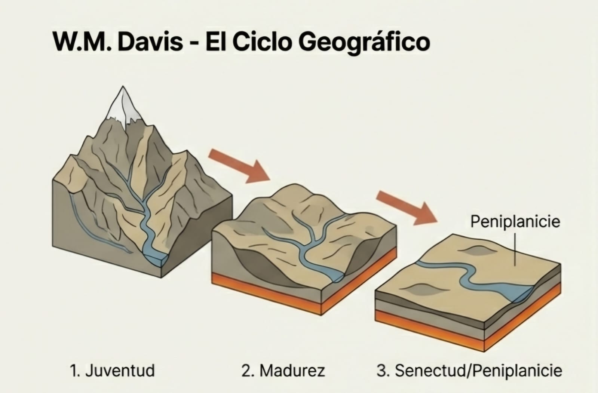
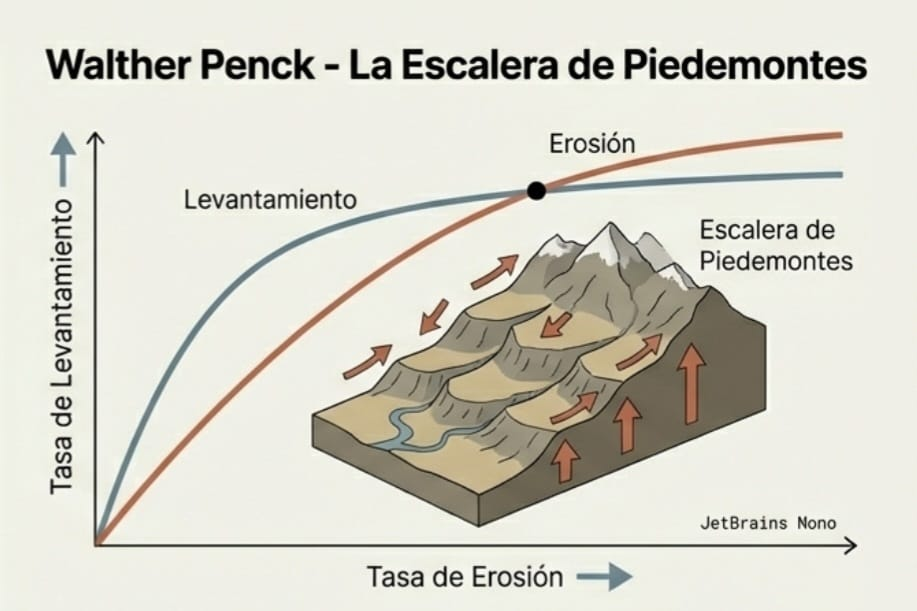

```{r setup, include=FALSE}
knitr::opts_chunk$set(
  echo = FALSE,
  message = FALSE,
  warning = FALSE,
  comment = "#>",
  fig.width = 7,
  fig.height = 5,
  out.width = "100%"
)
set.seed(123)

# Paquetes (ajusta según el ejercicio elegido)
pkg_needed <- c("vegan", "cluster", "indicspecies", "adespatial",
                "iNEXT", "SpadeR", "ggplot2", "dplyr", "tidyr", "readr")
has_pkg <- sapply(pkg_needed, requireNamespace, quietly = TRUE)
if (!all(has_pkg)) {
  message("Paquetes no críticos ausentes (se omitirán bloques opcionales): ",
          paste(names(has_pkg)[!has_pkg], collapse = ", "))
}
invisible(sapply(names(has_pkg)[has_pkg], library, character.only = TRUE))
```


# Resumen (Abstract)


**Palabras clave:** Geomorfología; Ciclo Geográfico; Davis; Penck; Evolución del Relieve.

# 1. Introducción

La geomorfología ha experimentado una transformación rotunda en su marco conceptual al evolucionar desde una disciplina principalmente histórica hacia una ciencia de procesos. La geomorfología histórica, fundamentada en el análisis cronológico y descriptivo del relieve [@davis1973geographical], dio paso a la geomorfología de procesos o sistémica, la cual estudia las interacciones fisicoquímicas que modelan la superficie terrestre a través de flujos de energía y materia, priorizando el análisis de sistemas abiertos en condiciones de equilibrio dinámico [@chorley1971physical; @strahler1950equilibrium] frente a la simple narrativa evolutiva del pasado. A pesar de este giro, persiste una notable desconexión entre la investigación de frontera y la enseñanza de las geociencias, ya que libros de texto fundamentales, como el influyente manual de Tarbuck y Lutgens [@lutgens2016foundations], continúan utilizando el "Ciclo Geográfico" de William Morris Davis como eje pedagógico, postulando que el relieve atraviesa una secuencia lineal de estadios —juventud, madurez y senectud— tras un levantamiento tectónico rápido [@davis1973geographical; @chorley2009history].

La persistencia de estos esquemas resulta paradójica, dado que sus premisas de estabilidad cortical prolongada contradicen los principios modernos de la isostasia y la tectónica de placas, los cuales demuestran que el levantamiento y la erosión operan como procesos simultáneos y concurrentes [@article]. La vigencia de los esquemas tradicionales en el currículo académico plantea una paradoja epistemológica fundamental: ¿por qué los modelos clásicos de evolución del relieve continúan como el pilar de la enseñanza geomorfológica a pesar de las severas objeciones que los rodean? Esta cuestión invita a considerar si ciertos componentes de la herencia davisiana, tales como su nomenclatura de estadios evolutivos, conservan todavía una utilidad descriptiva dentro de la narrativa del paisaje contemporáneo [@luo2024reincarnation]. Asimismo, surgen interrogantes sobre las contradicciones inherentes al modelo de Penck y la validez teórica de sus tesis sobre el *Piedmonttreppen* ante los avances de la geodinámica [@cleverson2024revisiting], pues el núcleo del debate reside en las fallas metodológicas y los supuestos tectónicos erróneos —específicamente la premisa de la estabilidad cortical— que precipitaron el declive de estas teorías en la investigación profesional [@orme2007rise].

Bajo este contexto, el presente trabajo tiene como objetivo general realizar una revisión crítica de los postulados de Davis y Penck para analizar la transición epistemológica hacia la geomorfología de procesos, identificando cómo las teorías de equilibrio dinámico de autores como Hack [@Hack1960InterpretationOE] invalidaron los sistemas cerrados. De manera específica, el estudio analiza la evolución de las vertientes y la terminología de estadios frente al concepto de retroceso paralelo de laderas de Penck [@penck1924], el cual sostiene que las pendientes mantienen su ángulo mientras retroceden lateralmente, desafiando la simplificación davisiana del suavizado de pendientes. Finalmente, el trabajo identifica las fallas geofísicas que propiciaron el declive de los modelos cíclicos y evalúa la función pedagógica de estos como un "andamiaje cognitivo" (*pedagogical scaffolding*) en textos actuales [@walsh2026pedagogical], determinando cómo sobreviven como herramientas didácticas a pesar de su obsolescencia en la investigación de vanguardia.

Para garantizar la validez de esta revisión, se emplea una metodología basada en la triangulación de perspectivas teóricas [@inbook], permitiendo contrastar los manuales de introducción con la literatura técnica más reciente. Este enfoque metodológico sigue los principios de la investigación científica cualitativa y documental [@arias2012proyecto], permitiendo una interpretación sociológica y teórica de la evolución del pensamiento geográfico [@denzin2017research]. Al integrar visiones clásicas con críticas contemporáneas sobre la geomorfología tectónica [@article; @barroso2013geomorphology] y el análisis morfométrico de sistemas de drenaje [@melton1958correlation], esta investigación busca esclarecer si la enseñanza de la geomorfología debe desprenderse definitivamente de su herencia cíclica o si esta cumple una función necesaria en la formación inicial de los científicos de la Tierra.


# 2. Materiales y Métodos

El presente estudio desarrolla un enfoque cualitativo de carácter epistemológico y documental mediante un diseño de revisión crítica que va mas allá la simple descripción bibliográfica para evaluar la validez de las teorías y la evolución de los paradigmas científicos [@arias2012proyecto]. La investigación centra su atención en el contraste dialéctico entre la geomorfología histórica de sistemas cerrados y la geomorfología de procesos basada en sistemas abiertos [@chorley1971physical]. Para ello, se integra una selección de fuentes: las obras fundacionales de Davis [@davis1973geographical] y Penck [@penck1924] para extraer los postulados originales; el manual de Lutgens, Tarbuck y Tasa [@lutgens2016foundations] como referente de la perpetuación de modelos históricos en la educación superior; y artículos de revisión sobre geodinámica e isostasia [@orme2007rise; @cleverson2024revisiting] que validan las inconsistencias de los modelos tradicionales frente a la investigación de frontera actual.

La estrategia de búsqueda y recolección de información se estructuró de forma cronológica y temática para delimitar claramente la brecha entre las fuentes antiguas y las contemporáneas. Se realizó una búsqueda sistemática en bases de datos de alto impacto y Google Scholar, empleando términos de búsqueda técnicos en inglés como *“Geomorphology”*, *“Cycle of erosion”*, *“Slope evolution”*, *“Orogeny”* y *“Equilibrium theory”* junto a los apellidos de los autores clave (*Davis*, *Penck*, *Hack*). La delimitación temporal permitió separar el corpus en dos bloques: fuentes primarias clásicas (1899-1924) para el análisis de los postulados originales, y fuentes críticas contemporáneas (2000-2026) para evaluar la vigencia didáctica y científica de dichos modelos en el siglo XXI [@luo2024reincarnation; @walsh2026pedagogical].

El análisis se basa en una triangulación teórica que permite converger diversas perspectivas científicas y metodológicas [@inbook; @denzin2017research]. En la primera etapa, se contrastan los estadios evolutivos de Davis ("juventud, madurez y senectud") con el "retroceso paralelo de laderas" y el *Piedmonttreppen* de Penck [@penck1924]. Posteriormente, estos modelos se evalúan bajo los principios de la termodinámica de sistemas abiertos y la teoría del equilibrio [@strahler1950equilibrium; @melton1958correlation]. Este enfoque permite identificar las fallas geofísicas derivadas de la premisa de estabilidad cortical prolongada y desglosar cómo la transición de una visión histórica a una procesal transformó la interpretación del relieve [@barroso2013geomorphology].

Finalmente, el análisis evalúa la dimensión pedagógica de estos modelos obsoletos, determinando su función como "andamiaje cognitivo" (*pedagogical scaffolding*) en los textos actuales de geociencias [@walsh2026pedagogical]. Se examina si el mantenimiento de la nomenclatura davisiana responde a una necesidad didáctica para facilitar el aprendizaje inicial o si representa un lastre epistemológico que distorsiona la comprensión de la tectónica activa [@article]. Esta fase final del análisis sintetiza la relación entre la investigación profesional y la enseñanza, utilizando la historia de la geomorfología para comprender por qué ciertas estructuras teóricas persisten en el currículo a pesar de haber sido superadas por el enfoque sistémico y de procesos [@chorley2009history].

# 3. Resultados

## 3.1. Discrepancias Estructurales entre Modelos Clásicos

Tras la revisión crítica de las fuentes primarias, la investigación identifica que la principal divergencia entre los modelos de Davis [@davis1973geographical] y Penck [@penck1924] radica en la temporalidad de la tectónica y la resultante evolución de las vertientes. Mientras que Davis postula un sistema cerrado con un levantamiento inicial rápido seguido de una quietud cortical prolongada, el análisis de Penck revela un sistema dinámico donde la erosión y el levantamiento operan como procesos concurrentes. Esta diferencia produce morfologías opuestas: el modelo davisiano genera un "suavizamiento de pendientes" (*slope decline*) hasta alcanzar la peneplanicie, mientras que el modelo de Penck desarrolla un "retroceso paralelo" (*slope retreat*) que da lugar a plataformas escalonadas o *Piedmonttreppen*. La Tabla 1 \@ref(tab:comparativa-modelos) sintetiza los supuestos críticos que fundamentan estas distinciones.

**Tabla 1.(\#tab:comparativa-modelos) Comparación de los supuestos críticos entre los modelos de Davis y Penck.

| Criterio | Modelo de Davis | Modelo de Penck |
| :--- | :--- | :--- |
| **Tectónica** | Levantamiento rápido e inicial. | Levantamiento y erosión simultáneos. |
| **Clima** | Templado/Húmedo (principalmente). | Factor secundario a la tectónica. |
| **Tiempo** | Factor lineal y determinante (estadios). | Irrelevante; prima la tasa de proceso. |
| **Laderas** | Descenso de pendiente (*Slope Decline*). | Retroceso de pendiente (*Slope Retreat*). |
| **Formas Finales** | Peneplanicie. | *Endrumpf* / *Piedmonttreppen*. |

## 3.2. Contradicciones con la Geofísica Moderna

Al contrastar estos modelos clásicos con los manuales contemporáneos [@lutgens2016foundations] y los principios de la geomorfología sistémica [@chorley1971physical], el estudio constata tres fallas críticas que socavan su validez científica en la investigación de frontera:

1. **Omisión de la Isostasia:** El ciclo de Davis ignora el levantamiento compensatorio de la litosfera por la descarga de masa erosiva. Esta omisión invalida la progresión lineal hacia una peneplanicie absoluta, ya que la corteza responde dinámicamente a la pérdida de peso por erosión [@orme2007rise].
2. **Entropía vs. Equilibrio Dinámico:** El relieve no funciona como un sistema termodinámicamente cerrado que agota su energía hacia una entropía máxima. Por el contrario, es un sistema abierto en equilibrio dinámico [@strahler1950equilibrium], donde las formas se ajustan constantemente a un flujo continuo de energía y materia [@melton1958correlation].
3. **Realismo Tectónico:** La tectónica de placas actual invalida la premisa de estabilidad cortical prolongada de los modelos decimonónicos, al postular movimientos continuos y la coexistencia de levantamiento y erosión como una norma y no como una excepción [@article].

## 3.3. Presencia de Modelos Obsoletos en Textos Base

El análisis del manual de Lutgens, Tarbuck y Tasa [@lutgens2016foundations] confirma la persistencia del modelo davisiano en la pedagogía actual de las geociencias. Aunque el texto reconoce los avances en la dinámica terrestre, mantiene la terminología de "juventud, madurez y vejez" como eje vertebrador en la descripción de la evolución del relieve fluvial. Los resultados indican que la literatura educativa retiene este modelo por su estructura narrativa simplificada y no por su precisión geofísica, estableciendo una dicotomía entre el rigor científico y la accesibilidad didáctica [@luo2024reincarnation].


## 2.1. Antecedentes y Estado del Arte: De la Narrativa al Proceso

La geomorfología, como disciplina científica, experimentó su primera gran sistematización a finales del siglo XIX con la propuesta del Ciclo Geográfico de William Morris Davis [@davis1973geographical]. Durante décadas, este modelo descriptivo dominó la disciplina, ofreciendo una visión de la Tierra donde el paisaje evolucionaba de forma predecible a través de estadios de juventud, madurez y vejez [@lutgens2016foundations]. En esta etapa, la geomorfología era fundamentalmente histórica y cualitativa.

Sin embargo, a mediados del siglo XX, surgieron críticas lideradas por la escuela alemana de Walther Penck [@7cb93337-d3d8-35b9-a0d0-62c1b0500514] y, posteriormente, por la Revolución Cuantitativa de Arthur Strahler [@strahler1950equilibrium]. Estos autores cuestionaron el "estatismo" de Davis, argumentando que el relieve no es un sistema cerrado cuya energía se agota con el pasar del tiempo, sino un sistema abierto que responde constantemente a la tectónica y al clima [@cleverson2024revisiting]. A pesar de que las investigaciones se desplazaron hacia el uso de modelos matemáticos y la geocronología, el interés por los modelos clásicos no ha desaparecido.

Como señala @luo2024reincarnation, las teorías de Davis han experimentado una "reencarnación" en el siglo XXI. Este nuevo interés no busca validar sus errores tectónicos, sino rescatar su valor como lenguaje común y herramienta pedagógica [@walsh2026pedagogical]. Por lo tanto, el debate entre "clásicos" y "modernos" no debe considerarse un capítulo terminado, sino una discusión necesaria para entender cómo la simplificación didáctica presente en textos base como el de @lutgens2016foundations convive con la complejidad de la investigación contemporánea [@orme2007rise].

---

## 2.2. Bases Teóricas: Los Modelos de Evolución del Relieve

### 2.2.1. El Ciclo Geográfico de W.M. Davis

El modelo davisiano se fundamenta en la premisa de que el paisaje es una función de la estructura, el proceso y el tiempo [@davis1973geographical]. El postulado central asume un levantamiento tectónico rápido e inicial de una masa de tierra, seguido de un prolongado periodo de estabilidad cortical donde la erosión actúa sin interrupciones tectónicas [@lutgens2016foundations].

Davis dividió esta evolución en estadios cronológicos, como se puede ver en la 


Figura \@ref(fig:ciclo-davis):

```{r ciclo-davis, fig.cap="Ciclo de Davis: juventud, madurez y vejez", out.width="50%", fig.align="center", echo=FALSE}

```

* **Juventud:** Caracterizada por valles estrechos en forma de "V" y una alta energía fluvial.
* **Madurez:** Donde el relieve alcanza su máxima diferenciación y los valles se ensanchan.
* **Vejez:** El estadio final donde la superficie se reduce a una *peneplanicie*, una llanura casi sin rasgos situada cerca del nivel de base [@orme2007rise]. 

### 2.2.2. El Análisis Morfológico de Walther Penck

Penck rechazó la idea de un levantamiento instantáneo, proponiendo que la erosión y la tectónica son procesos concurrentes. Su análisis se centra en la relación entre la intensidad del levantamiento y la tasa de degradación fluvial [@7cb93337-d3d8-35b9-a0d0-62c1b0500514].

A diferencia del "suavizamiento" de Davis, Penck introdujo el concepto de retroceso paralelo de las vertientes (*slope replacement*). Como se puede observar en la Figura \@ref(fig:fig-penck),  en este modelo, las pendientes escarpadas mantienen su ángulo mientras retroceden, siendo reemplazadas en la base por pendientes más suaves [@cleverson2024revisiting]. Este proceso da lugar al *Piedmonttreppen* o "escalinata de piedemonte", una serie de plataformas escalonadas que Penck interpretaba como evidencia de pulsos tectónicos de intensidad creciente [@7cb93337-d3d8-35b9-a0d0-62c1b0500514].

```{r fig-penck, fig.cap="Modelo de evolución de vertientes de Walther Penck. Imagen generada mediante NotebookLM (2024).", out.width="50%", fig.align="center", fig.pos="H", echo=FALSE}

```

### 2.2.3. Mecanismos Comparados

Para sintetizar las diferencias fundamentales entre ambos enfoques, se presenta la Tabla \@ref(tab:comparativa-modelos), la cual resume los supuestos críticos de cada autor:

Table: (\#tab:comparativa-modelos) Comparación de los supuestos críticos entre los modelos de Davis y Penck. Generado mediante NotebookLM.

| Criterio | Modelo de Davis | Modelo de Penck |
| :--- | :--- | :--- |
| **Tectónica** | Levantamiento rápido e inicial. | Levantamiento y erosión simultáneos. |
| **Clima** | Templado/Húmedo (principalmente). | Factor secundario a la tectónica. |
| **Tiempo** | Factor lineal y determinante (estadios). | Irrelevante; prima la tasa de proceso. |
| **Laderas** | Descenso de pendiente (*Slope Decline*). | Retroceso de pendiente (*Slope Retreat*). |
| **Formas Finales** | Peneplanicie. | *Endrumpf* / *Piedmonttreppen*. |
---

## 2.3. Definición de Conceptos Clave

Para garantizar la precisión en la revisión crítica de los modelos, es imperativo establecer las definiciones técnicas de los conceptos que articulan la transición de la geomorfología histórica a la de procesos.

### 2.3.1. Peneplanicie (*Peneplain*)

Concepto central del modelo davisiano que describe el estadio final de la degradación continental. Se define como:

> "Una superficie de erosión de gran extensión que presenta un relieve ondulado muy suave, situada cerca del nivel de base, y que representa el límite teórico de la denudación tras un largo periodo de estabilidad tectónica" [@davis1973geographical; en @lutgens2016foundations].

### 2.3.2. *Piedmonttreppen* (Escalinata de Piedemonte)

Concepto introducido por la escuela alemana para explicar paisajes escalonados en áreas de levantamiento activo:

> "Una sucesión de llanuras de erosión dispuestas en forma de niveles o escalones en los flancos de una masa montañosa, interpretadas como el resultado de un levantamiento tectónico cuya velocidad aumenta de forma rítmica o acelerada" [@7cb93337-d3d8-35b9-a0d0-62c1b0500514].

### 2.3.3. Equilibrio Dinámico (*Dynamic Equilibrium*)

Postulado fundamental de la geomorfología de procesos que reemplaza la idea de "estadios":

> "Una condición en la que las formas del relieve y los procesos que las modelan alcanzan un estado de ajuste mutuo, donde la morfología del paisaje permanece constante en el tiempo porque la energía de entrada (levantamiento) se equilibra exactamente con la energía de salida (erosión)" [@strahler1950equilibrium].

### 2.3.4. Isostasia (*Isostasy*)

Concepto geofísico que Davis ignoró en su modelo original, pero que es vital para explicar por qué las montañas no desaparecen tan rápido como él predecía:

> "El estado de equilibrio gravitacional entre la litosfera y la astenosfera, de tal manera que las placas tectónicas 'flotan' a una altura que depende de su espesor y densidad; cuando la erosión retira masa de una montaña, la isostasia provoca un levantamiento compensatorio de la raíz" [@lutgens2016foundations].

### 2.3.5. Nivel de Base (Base Level)
Concepto que actúa como el límite teórico de la erosión davisiana:

>“Se define como el límite inferior de la erosión del relieve, representado generalmente por el nivel del mar. Es el plano hacia el cual tienden todas las corrientes de agua y el factor que condiciona la formación de la peneplanicie al limitar la capacidad de profundización de los valles” [@lutgens2016foundations].

---

## 2.4. Bases Epistemológicas y Críticas: El Cambio de Paradigma

La transición de la geomorfología clásica a la contemporánea representó una evolución desde la visión de sistemas cerrados hacia los abiertos.

### 2.4.1. Sistemas Cerrados vs. Sistemas Abiertos

El modelo de Davis se fundamenta epistemológicamente en la idea de un sistema cerrado. En este enfoque, el levantamiento inicial dota al relieve de una cantidad finita de energía potencial. A medida que el ciclo progresa hacia la 'vejez', esa energía se disipa mediante la erosión hasta que el sistema alcanza un estado de entropía máxima: la peneplanicie [@orme2007rise]. Como se ilustra en la Figura\@ref(fig:fig-dif-termodin), este proceso implica un agotamiento irreversible del trabajo geomórfico, a diferencia de los modelos de sistemas abiertos donde el flujo de energía es constante."

```{r fig-dif-termodin, fig.cap="Diferencias termodinámicas entre el sistema cerrado davisiano y el sistema abierto contemporáneo (generada con NotebookLM, 2024)", out.width="70%", fig.align="center", echo=FALSE}
knitr::include_graphics("dif-termodin.jpeg")
```

Por el contrario, la geomorfología moderna, influenciada por la teoría general de sistemas, define al relieve como un **sistema abierto**. Aquí, el paisaje está en constante intercambio de materia y energía con su entorno (tectónica activa, clima cambiante e isostasia). No existe un "final" predeterminado, sino un estado de equilibrio dinámico donde las formas se ajustan continuamente a las fuerzas externas ([@strahler1950equilibrium; @cleverson2024revisiting]).

### 2.4.2. El Cambio de Paradigma: De la Narrativa a la Física

El declive definitivo de los modelos clásicos ocurrió con la *Revolución Cuantitativa*. El punto de ruptura fue marcado por @strahler1950equilibrium, quien criticó la naturaleza puramente deductiva y subjetiva del ciclo geográfico.

Strahler argumentó que la geomorfología debía dejar de ser una "narrativa histórica" basada en estadios imaginarios para convertirse en una ciencia física rigurosa.

> "La geomorfología debe basarse en leyes físicas y análisis cuantitativos, reemplazando la descripción cualitativa de 'juventud' o 'vejez' por el estudio de los procesos dinámicos en equilibrio" [@strahler1950equilibrium].

Este cambio de paradigma hacia la física de procesos dejó a los modelos de Davis y Penck en una posición de obsolescencia para la investigación de frontera. Sin embargo, paradójicamente, su estructura lógica y visual permitió que permanecieran vigentes en un ámbito distinto: la educación superior y la divulgación científica, lo que plantea una dicotomía entre la precisión geofísica y la claridad pedagógica que se explora a continuación.

---

## 2.5. Justificación de la Persistencia Pedagógica: El Valor de la Simplificación

La permanencia de los modelos clásicos en la bibliografía contemporánea [@book] no responde a una falta de actualización científica, sino a una estrategia didáctica deliberada.

### 2.5.1. El Modelo de Davis como "Mal Necesario"

Según argumentan @walsh2026pedagogical, la teoría de Davis funciona como un “mal necesario” o un andamiaje cognitivo. El uso de este modelo se justifica por su capacidad para simplificar sistemas multivariables en una narrativa lineal y fácil de asimilar. Según Luo (2024), es más efectivo introducir a un estudiante en la geomorfología mediante estadios antropomórficos (juventud, madurez, vejez) antes de abordar la complejidad no lineal de los sistemas abiertos, siempre que se aclare que el modelo es una abstracción didáctica y no una realidad geofísica absoluta.


### 2.5.2. El Valor Didáctico del Contraste

La persistencia de estos modelos permite utilizar el método del contraste. Al presentar el retroceso paralelo de laderas de Penck frente al suavizamiento de Davis [@7cb93337-d3d8-35b9-a0d0-62c1b0500514], se fomenta el pensamiento crítico.

---

## 2.6. Síntesis de Definiciones Operativas

Para efectos de esta revisión crítica, se adoptan las siguientes definiciones fundamentales:

* **Retroceso Paralelo de Laderas:** "Proceso erosivo donde la inclinación de la pendiente se mantiene constante mientras la pared del relieve retrocede hacia el centro del bloque tectónico" [@7cb93337-d3d8-35b9-a0d0-62c1b0500514].
* **Equilibrio Dinámico:** "Condición en la que las formas del relieve se ajustan para permitir el transporte de sedimentos con la máxima eficiencia, manteniendo una morfología estable a pesar del cambio continuo en el flujo de energía y materia" [@strahler1950equilibrium].
* **Sistema Abierto: “Estado de organización del relieve donde existe un flujo continuo de energía y materia. A diferencia del sistema cerrado de Davis, un sistema abierto no tiene un final predeterminado (entropía), sino que mantiene su forma a través de ajustes constantes entre el levantamiento tectónico y la denudación” [@strahler1950equilibrium]


## 2.3. Definición de Conceptos Clave (Glosario Técnico)
* **Peneplanicie:** Definición según Davis (1899).
* **Equilibrio Dinámico:** Definición según Strahler (1950).
* **Isostasia:** Definición según Tarbuck & Lutgens (2005).

# 3. Discusión: El Cambio de Paradigma (Subpregunta 3)


# 4. Conclusiones


# Referencias Bibliográficas
